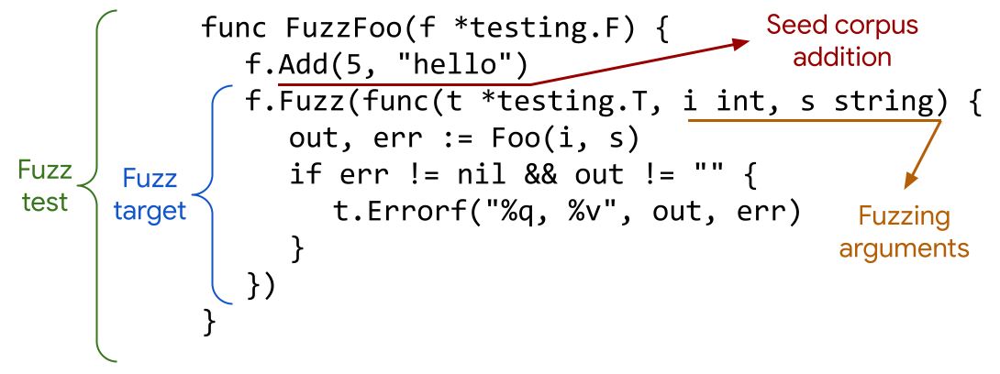

# Seminar: Fuzzing in Go

by Salina Körner

for the seminar by Professor Sulzmann:
[Seminar Overview GitHub](https://github.com/sulzmann/Seminar/blob/main/winter24-25.md)
----
<!-- TOC -->

* [Seminar: Fuzzing in Go](#seminar-fuzzing-in-go)
    * [T3: Go's Built-In Fuzzer](#t3-gos-built-in-fuzzer)
* [What is fuzz testing?](#what-is-fuzz-testing)
* [Fuzzing in Go](#fuzzing-in-go)
    * [Requirements](#requirements)
    * [Structure of a fuzz test](#structure-of-a-fuzz-test)
    * [Output of a fuzz test](#output-of-a-fuzz-test)
        * [Meaning of the output](#meaning-of-the-output)
    * [How the Go fuzzer works](#how-the-go-fuzzer-works)
* [Autonome Systeme Examples](#autonome-systeme-examples)
    * [Deadlock Example](#deadlock-example)
    * [Livelock Example](#livelock-example)
    * [Starvation Example](#starvation-example)
    * [Data Race Example](#data-race-example)
    * [Philo Example](#philo-example)
* [Data Race Detection with the Go Fuzzer](#data-race-detection-with-the-go-fuzzer)
    * [Data Race Example](#data-race-example-1)
* [General use cases of the Go fuzzer](#general-use-cases-of-the-go-fuzzer)
* [Pros and Cons / Advantages and Limitations](#pros-and-cons--advantages-and-limitations)
* [Conclusion and lessons learned](#conclusion-and-lessons-learned)
* [Sources / Literature](#sources--literature)

<!-- TOC -->

----

## T3: Go's Built-In Fuzzer

Topic: How effective is Go fuzzing to detect concurrency bugs?

1. As a starting point, consider the bug scenarios and examples discussed in Autonome Systeme.

2. There are further fuzzing tools for concurrent Go. See below. Check out some of the examples used and.

3. Apply Go fuzzing and report your experiences.

----

# What is fuzz testing?

[Fuzz testing](https://en.wikipedia.org/wiki/Fuzzing) (also called fuzzing) is a testing technique, in which random data is used as inputs to find bugs in a
program. A fuzzer checks for inputs that cause an error in the program.

# Fuzzing in Go

## Requirements

- Go 1.18 or later
- ARM64 or AMD64 architecture

## Structure of a fuzz test

This is the structure of a fuzz test.

The naming convention suggests placing it in a file with the name {FileToTest}_test.go.

The name of the fuzz test needs to start with "Fuzz" followed by the name of the function, e.g. Fuzz{FunctionName}).



- **Fuzz test**: The fuzz test is the entire test with all its required parts, including fuzz target, fuzzing arguments
  and
  seed additions.
- **Fuzz target**: The function that is being executed with the corpus entries and the generated inputs.
- **Fuzzing arguments**: The fuzzing arguments are the data types that are being passed to the fuzzing function. These
  are
  also mutated to generate new inputs.
- **Seed corpus addition**: That is the arguments provided by the programmer to be added to the corpus.

## Output of a fuzz test

```
λ go test -fuzz=FuzzDatarace -race
fuzz: elapsed: 0s, gathering baseline coverage: 0/3 completed
fuzz: elapsed: 0s, gathering baseline coverage: 3/3 completed, now fuzzing with 8 workers
fuzz: elapsed: 3s, execs: 971 (324/sec), new interesting: 4 (total: 7)
fuzz: elapsed: 6s, execs: 1870 (300/sec), new interesting: 4 (total: 7)
fuzz: elapsed: 9s, execs: 2674 (268/sec), new interesting: 5 (total: 8)
fuzz: elapsed: 12s, execs: 3643 (323/sec), new interesting: 5 (total: 8)
fuzz: elapsed: 15s, execs: 4355 (237/sec), new interesting: 5 (total: 8)
fuzz: elapsed: 16s, execs: 4400 (38/sec), new interesting: 5 (total: 8)
--- FAIL: FuzzDatarace (16.19s)
    --- FAIL: FuzzDatarace (0.00s)
        testing.go:1399: race detected during execution of test

    Failing input written to testdata\fuzz\FuzzDatarace\b5dd7ee3ea717225
    To re-run:
    go test -run=FuzzDatarace/b5dd7ee3ea717225
FAIL
exit status 1
FAIL    main/main/datarace      16.479s
```

### Meaning of the output

- **-fuzz=FuzzDataRace:** the name of the fuzz test (in this case FuzzDataRace)
- **baseline coverage:** running the function with an initial set of inputs to ensure code coverage.
- **fuzzing with 8 workers:** means there are 8 concurrent test runners, this corresponds to the number of kernels of
  the pc
- **elapsed:** seconds since the fuzzing process started
- **execs:** number inputs tested, number of functions executed
- **new interesting:** number of newly discovered inputs that lead to previously undiscovered code paths.
  An input is considered interesting if it expands the code coverage with more than what the currently generated corpus
  already reached. In the brackets you can see the total size of the generated corpus.

- after over 2.618.761 executions the process failed, which means there is a problem in the function

## How the Go fuzzer works

When running a fuzz test Go starts with the seed corpus to get an initial generated corpus.
With a mutator it creates new inputs by generating new inputs, randomly modifying inputs or combining them.

The Go built-in fuzzer then takes the newly generated inputs and keeps running the test.

The Go fuzzer is coverage guided. That means it learns from the code coverage that is expanded by new inputs. It tries
to explore as many new code paths as possible.
A "new interesting" is a path that has previously been undiscovered.
The "new interesting" amount will increase the most in the beginning, but as the fuzzing process continues to work,
there
will be less and less new interestings, as it won't find as many new code paths anymore.
It keeps track of the "new interesting" and tries to mutate those,so inputs hopefully lead to a previously undiscovered
code path.

The fuzzing process stops when the fuzzer found a bug or the user manually stops it.
It can fail because of panics, runtime errors, asserting t.Error or when user written validation logic fails.

If the fuzzer finds a failing input it minimizes the input to the smallest input possible that still reproduces the
failing behaviour. It is then added to the corpus and can be found in a directory usually called "
testdata/fuzz/{FuzzTestName}".
Since it is saved it can be used for future test runs.

# Autonome Systeme Examples

Summary:

- Bugs scenarios are:
    - deadlock
    - livelock
    - starvation
    - data race

## Deadlock Example

```
package main

import "fmt"

func snd(ch chan int) {
var x int = 0
x++
ch <- x
}

func rcv(ch chan int) {
var x int
x = <-ch
fmt.Printf("received %d \n", x)

}

func main() {
var ch chan int = make(chan int)
go rcv(ch)   // R1
go snd(ch)   // S1
rcv(ch)      // R2

}
```

Fuzz test

```
package deadlock

import "testing"

func FuzzDeadlock(f *testing.F) {
	f.Add(1)
	f.Fuzz(func(t *testing.T, input int) {
		var ch chan int = make(chan int)

		go rcv(ch) // R1
		go snd(ch) // S1
		rcv(ch) //R2
	})
}
```

sample run

```
λ go test -fuzz=FuzzDeadlock
fuzz: elapsed: 0s, gathering baseline coverage: 0/1 completed
fuzz: elapsed: 0s, gathering baseline coverage: 1/1 completed, now fuzzing with 8 workers
fuzz: elapsed: 3s, execs: 7864 (2620/sec), new interesting: 8 (total: 9)
fuzz: elapsed: 6s, execs: 7864 (0/sec), new interesting: 8 (total: 9)
fuzz: elapsed: 9s, execs: 7864 (0/sec), new interesting: 8 (total: 9)
fuzz: elapsed: 10s, execs: 7994 (107/sec), new interesting: 8 (total: 9)
--- FAIL: FuzzDeadlock (10.22s)
    fuzzing process hung or terminated unexpectedly: exit status 2
    Failing input written to testdata\fuzz\FuzzDeadlock\0591344243e3314b
    To re-run:
    go test -run=FuzzDeadlock/0591344243e3314b
FAIL
exit status 1
FAIL    main/main/deadlock      10.503s
```

## Livelock Example

```package main

import "fmt"
import "time"

func main() {
var x int
y := make(chan int, 1)

    // T2
    go func() {
        y <- 1
        x++
        <-y

    }()

    x++
    y <- 1
    <-y

    time.Sleep(1 * 1e9)
    fmt.Printf("done \n")

}
```

Fuzz test

```
package livelock

import (
	"testing"
	"time"
)

func FuzzLivelock(f *testing.F) {
	f.Add(1)

	f.Fuzz(func(t *testing.T, input int) {
		go livelock()
		time.Sleep(1 * time.Second)
	})
}

```

Sample run

Does not detect a bug -> Starvation is also hard to prove as you have to prove that the programm keeps running without
ever actually making any progress.

## Starvation Example

```
package main

import "fmt"
import "time"

  func snd(ch chan int) {
    var x int = 0
    for {
      x++
      ch <- x
      time.Sleep(1 * 1e9)
  }

}

  func rcv(ch chan int) {
  var x int
  for {
    x = <-ch
    fmt.Printf("received %d \n", x)
  }

}

func main() {
var ch chan int = make(chan int)
go rcv(ch)   // R1
go snd(ch)   // S1
rcv(ch)      // R2

}
```

Fuzz test

```
package starvation

import (
	"testing"
)

func FuzzStarvation(f *testing.F) {
	f.Add(0)

	f.Fuzz(func(t *testing.T, _ int) {
		var ch chan int = make(chan int)
		
		go rcv(ch) // R1
		go snd(ch) // S1
		rcv(ch)    // R2

	})
}

```

Sample run

```
λ go test -fuzz=FuzzStarvation
fuzz: elapsed: 0s, gathering baseline coverage: 0/5 completed
fuzz: elapsed: 3s, gathering baseline coverage: 0/5 completed
fuzz: elapsed: 6s, gathering baseline coverage: 0/5 completed
fuzz: elapsed: 9s, gathering baseline coverage: 0/5 completed
failure while testing seed corpus entry: FuzzStarvation/seed#0
fuzz: elapsed: 10s, gathering baseline coverage: 0/5 completed
--- FAIL: FuzzStarvation (10.07s)
    fuzzing process hung or terminated unexpectedly: exit status 2
FAIL
exit status 1
FAIL    main/main/starvation    10.352s
```

The fuzzing-process stopped.

## Data Race Example

```
package main

import "fmt"
import "time"

func main() {
var x int
y := make(chan int, 1)

    // T2
    go func() {
        y <- 1
        x++
        <-y

    }()

    x++
    y <- 1
    <-y

    time.Sleep(1 * 1e9)
    fmt.Printf("done \n")

}
```

Fuzz test

```
package datarace

import "testing"
import "time"

func FuzzDatarace(f *testing.F) {
f.Add(50)

	f.Fuzz(func(t *testing.T, delayMs int) {
		delay := time.Duration(delayMs) * time.Millisecond
		datarace(delay)
	})
}
```

Sample run

```
λ go test -fuzz=FuzzDatarace -race
fuzz: elapsed: 0s, gathering baseline coverage: 0/3 completed
fuzz: elapsed: 0s, gathering baseline coverage: 3/3 completed, now fuzzing with 8 workers
fuzz: elapsed: 3s, execs: 971 (324/sec), new interesting: 4 (total: 7)
fuzz: elapsed: 6s, execs: 1870 (300/sec), new interesting: 4 (total: 7)
fuzz: elapsed: 9s, execs: 2674 (268/sec), new interesting: 5 (total: 8)
fuzz: elapsed: 12s, execs: 3643 (323/sec), new interesting: 5 (total: 8)
fuzz: elapsed: 15s, execs: 4355 (237/sec), new interesting: 5 (total: 8)
fuzz: elapsed: 16s, execs: 4400 (38/sec), new interesting: 5 (total: 8)
--- FAIL: FuzzDatarace (16.19s)
    --- FAIL: FuzzDatarace (0.00s)
        testing.go:1399: race detected during execution of test

    Failing input written to testdata\fuzz\FuzzDatarace\b5dd7ee3ea717225
    To re-run:
    go test -run=FuzzDatarace/b5dd7ee3ea717225
FAIL
exit status 1
FAIL    main/main/datarace      16.479s
```

The fuzzer detected a race with the -race flag from the Go race detector.
The race however was also detected with only the -race tag and without the fuzzer

## Philo Example

The example: The Dining Philosophers Problem

N philosophers sit at a table with a total of N forks. Each philosopher requires 2 forks to eat.

Possible bugs:

- deadlock
- starvation

```
package main

import "fmt"
import "time"

func philo(id int, forks chan int) {

	for {
		<-forks
		<-forks
		fmt.Printf("%d eats \n", id)
		time.Sleep(1 * 1e9)
		forks <- 1
		forks <- 1

		time.Sleep(1 * 1e9) // think

	}

}

func main() {
  var forks = make(chan int, 3)
  forks <- 1
  forks <- 1
  forks <- 1
  go philo(1, forks)
  go philo(2, forks)
  philo(3, forks)
}
```

The fuzz test:

```
package main

import "testing"

func FuzzPhilo(f *testing.F) {

	f.Add(1)
	f.Add(2)
	f.Add(3)

	forks := make(chan int, 3)
	forks <- 1
	forks <- 1
	forks <- 1

	f.Fuzz(func(t *testing.T, id int) {
		go philo(id, forks)
	})
}
```

The sample output of the fuzz test:

```
λ go test -fuzz=FuzzPhilo

fuzz: elapsed: 0s, gathering baseline coverage: 0/3 completed
fuzz: elapsed: 0s, gathering baseline coverage: 3/3 completed, now fuzzing with 8 workers
fuzz: elapsed: 3s, execs: 249422 (82902/sec), new interesting: 14 (total: 17)
fuzz: elapsed: 6s, execs: 430488 (60524/sec), new interesting: 14 (total: 17)
fuzz: elapsed: 9s, execs: 628640 (65775/sec), new interesting: 14 (total: 17)
fuzz: elapsed: 12s, execs: 817335 (62933/sec), new interesting: 14 (total: 17)
fuzz: elapsed: 15s, execs: 1072511 (84920/sec), new interesting: 14 (total: 17)
fuzz: elapsed: 18s, execs: 1304837 (77489/sec), new interesting: 14 (total: 17)
fuzz: elapsed: 21s, execs: 1532728 (76017/sec), new interesting: 14 (total: 17)
fuzz: elapsed: 24s, execs: 1729492 (65671/sec), new interesting: 14 (total: 17)
fuzz: elapsed: 27s, execs: 1821319 (30686/sec), new interesting: 14 (total: 17)
fuzz: elapsed: 30s, execs: 1935366 (37577/sec), new interesting: 14 (total: 17)
fuzz: elapsed: 33s, execs: 2094398 (53638/sec), new interesting: 14 (total: 17)
fuzz: elapsed: 36s, execs: 2195395 (33628/sec), new interesting: 14 (total: 17)
fuzz: elapsed: 39s, execs: 2315483 (40008/sec), new interesting: 14 (total: 17)
fuzz: elapsed: 42s, execs: 2437627 (40782/sec), new interesting: 14 (total: 17)
fuzz: elapsed: 45s, execs: 2557238 (39877/sec), new interesting: 14 (total: 17)
fuzz: elapsed: 47s, execs: 2618761 (32256/sec), new interesting: 14 (total: 17)
--- FAIL: FuzzPhilo (46.91s)
fuzzing process hung or terminated unexpectedly: exit status 2
Failing input written to testdata\fuzz\FuzzPhilo\ace36d9332763359
To re-run:
go test -run=FuzzPhilo/ace36d9332763359
FAIL
exit status 1
FAIL    main/main/philo 47.207s
```

The fuzzer failed.

# Data Race Detection with the Go Fuzzer

Here is an example that includes a data race. The two go routines (main and T2) both try to increment (a write
operation)
the variable x.

## Data Race Example

```
package main

import "fmt"
import "time"

func main() {
var x int
y := make(chan int, 1)

    // T2
    go func() {
        y <- 1
        x++
        <-y

    }()

    x++
    y <- 1
    <-y

    time.Sleep(1 * 1e9)
    fmt.Printf("done \n")

}
```

Fuzz test

```
package datarace

import "testing"
import "time"

func FuzzDatarace(f *testing.F) {
f.Add(50)

	f.Fuzz(func(t *testing.T, delayMs int) {
		delay := time.Duration(delayMs) * time.Millisecond
		datarace(delay)
	})
}
```

Sample runs

one of the first runs:

```
λ go test -fuzz=FuzzDatarace -race
fuzz: elapsed: 0s, gathering baseline coverage: 0/3 completed
fuzz: elapsed: 0s, gathering baseline coverage: 3/3 completed, now fuzzing with 8 workers
fuzz: elapsed: 3s, execs: 971 (324/sec), new interesting: 4 (total: 7)
fuzz: elapsed: 6s, execs: 1870 (300/sec), new interesting: 4 (total: 7)
fuzz: elapsed: 9s, execs: 2674 (268/sec), new interesting: 5 (total: 8)
fuzz: elapsed: 12s, execs: 3643 (323/sec), new interesting: 5 (total: 8)
fuzz: elapsed: 15s, execs: 4355 (237/sec), new interesting: 5 (total: 8)
fuzz: elapsed: 16s, execs: 4400 (38/sec), new interesting: 5 (total: 8)
--- FAIL: FuzzDatarace (16.19s)
    --- FAIL: FuzzDatarace (0.00s)
        testing.go:1399: race detected during execution of test

    Failing input written to testdata\fuzz\FuzzDatarace\b5dd7ee3ea717225
    To re-run:
    go test -run=FuzzDatarace/b5dd7ee3ea717225
FAIL
exit status 1
FAIL    main/main/datarace      16.479s
```

Running the fuzz test with the -race flag turns out to detect a race within around 17 seconds.

a later run:

```
λ go test -fuzz=FuzzDatarace -race
fuzz: elapsed: 0s, gathering baseline coverage: 0/19 completed
fuzz: elapsed: 0s, gathering baseline coverage: 19/19 completed, now fuzzing with 8 workers
fuzz: elapsed: 2s, execs: 982 (502/sec), new interesting: 0 (total: 19)
--- FAIL: FuzzDatarace (1.97s)
    --- FAIL: FuzzDatarace (0.00s)
        testing.go:1399: race detected during execution of test

    Failing input written to testdata\fuzz\FuzzDatarace\b45ecfe30afa5f31
    To re-run:
    go test -run=FuzzDatarace/b45ecfe30afa5f31
FAIL
exit status 1
FAIL    main/main/datarace      2.242s
```

The later runs reports a race much quicker than the first one, because it has more code coverage.

# General use cases of the Go fuzzer

- Where deterministic unit tests don't discover bugs fuzz testing can help discover them by showing how the code behaves
  when encountering random inputs.
- Incorrect rune decoding
- Finding bugs when parsing inputs
- data races

# Pros and Cons / Advantages and Limitations

| Advantages                                                                              | Disadvantages                                                 |
|-----------------------------------------------------------------------------------------|---------------------------------------------------------------|
| can find bugs which unit tests can't find                                               | not a lot of documentation available, because it's fairly new |
| seems to be good at finding data races which the data race detector doesn't always find | doesn't always find every bug                                 |
| can be useful for parsing errors or incorrect rune decoding                             | only few data types are supported as fuzzing arguments        |
| can find bugs the programmer didn't even think about or didn't write a test for         | can take a long time and a lot of resources                   |

# Conclusion and lessons learned

To summarize one can say that the built-in Go fuzzer has proven to be a useful tool for finding some bugs. It is
however not fail-proof, as it cannot detect every single bug in a program.

While generating inputs tests the program with a wider range of inputs, not all generated inputs are useful in helping
to find a bug. Some inputs would not normally occur in the day to day use of a program. So it may help finding edge case
bugs, whichs discovery doesn't help to improve the code.

The Go built-in fuzzer seems to better at detecting data races, than the Go data race detector. Because sometimes
running a test with the -race flag didn't find a data race, the Go built-in fuzzer however did.

Although fuzz testing can discover unexpected bugs, it is still not a testing type that finds every possible bug in a
project. So fuzzing can prove the existence of a bug, but not the absence of one.

Go fuzzing in general also uses more resources than unit tests, because generating a lot of inputs and running a high
number of test can be computationally expensive.

Fuzz tests and especially fuzz targets need to be chosen carefully, as sometimes the fuzz test can fail due to
irrelevant inputs.

# Sources / Literature

go.dev

- [Go fuzz doc](https://go.dev/doc/security/fuzz/)
- [Go fuzz tutorial](https://go.dev/doc/tutorial/fuzz)
- [Source code fuzz.go](https://go.dev/src/internal/fuzz/fuzz.go)

blog articles

- [Best practices for go fuzzing in Go 1.18](https://faun.pub/best-practices-for-go-fuzzing-in-go-1-18-84eab46b70d8)
- [The state of Go Fuzzing: Did we already reach the peak](https://0x434b.dev/the-state-of-go-fuzzing-did-we-already-reach-the-peak/#native-go-fuzzing-is-it-advancing)
- [Finding bugs with go fuzzing](https://bitfieldconsulting.com/posts/bugs-fuzzing)

youtube videos

- [How to write a fuzz test | Demo](https://www.youtube.com/watch?v=y8Rpb3nrJn8&t=324s)
- [Introduction to Fuzzing](https://www.youtube.com/watch?v=-hc6LGA46Bg)

picture: [fuzz test structure](https://go.dev/doc/security/fuzz/)